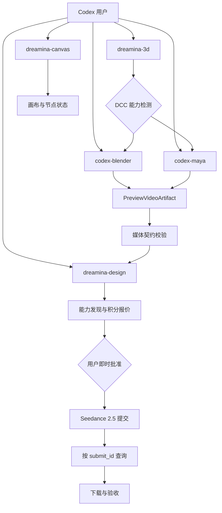
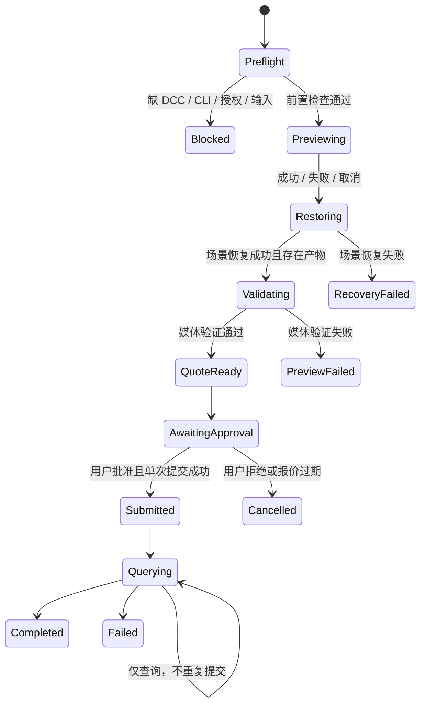
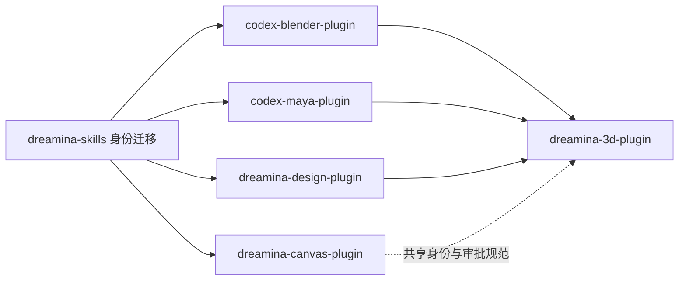

# Dreamina 五插件套件文档设计规格

> **文档说明**：定义 `codex-blender-plugin`、`codex-maya-plugin`、`dreamina-canvas-plugin`、`dreamina-design-plugin`、`dreamina-3d-plugin` 的双语架构文档、技术方案、README 和后续实施计划的统一边界。
>
> **版本**：V1.0.0  
> **最后更新**：2026-09-11  
> **状态**：待用户评审

## 1. 目标与交付范围

本阶段只交付可检查的规划与文档，不执行以下操作：

- 不重命名本地 `dreamina-skills` 目录。
- 不重命名 `full-aigc-skills/dreamina-skills` GitHub 仓库。
- 不创建五个插件仓库。
- 不安装 Dreamina、Blender、Maya 或 ffmpeg。
- 不运行付费图片或视频生成。
- 不复制即梦官方 Blender/Maya 插件源码、品牌资产或随包二进制。

本阶段完成以下文档产物：

1. 一份本规格。
2. 一份依赖有序、可逐项检查的实施计划。
3. 五个插件各六份文档：中英文架构、中英文技术方案、中英文 README，共 30 份。

## 2. 已确认事实与证据

| 事实 | 状态 | 证据 |
|:---|:---|:---|
| 当前技能库包含 13 个一级 Skill 目录 | 已确认 | 本地 `skills/` 目录审计，2026-09-11 |
| 当前多数目录和 frontmatter 使用 `jimeng-*`，已有一个 `dreamina-cli` | 已确认 | 本地 Skill 路径与 `SKILL.md` |
| 当前 GitHub 仓库为 `full-aigc-skills/dreamina-skills` | 已确认 | Git remote 与 README |
| Dreamina CLI 文档当前记录 v1.4.18 | 已确认 | 即梦 CLI 体验指南，2026-09-11 读取 |
| `dreamina-canvas` 支持画布、节点、模型、报价、批准、异步任务和资源操作 | 已确认 | 画布 CLI 使用说明，2026-09-11 读取 |
| Blender 官方包版本为 1.0.0 | 已确认 | 即梦 3D 渲染插件下载页 |
| Blender Mac 包 SHA-256 为 `471b315b8da91023be46496f902f7d64c1b48b91567d10cd442de7dffe0d68ae` | 已确认 | 下载包本地哈希 |
| Blender 官方包包含相机渲染、本地视频、分辨率、材质预览、ffmpeg 转码和短生命周期本地 bridge | 已确认 | 下载包 README 和符号级 clean-room 审计 |
| Maya 官方包提供安装、相机渲染和本地视频两条流程 | 已确认 | 白模渲染使用手册 |
| Maya 包内部实现与兼容矩阵 | 待实施阶段确认 | 必须下载对应 Mac/Windows 包并记录版本、哈希、清单和许可 |

任何最终文档不得把“目标设计”写成“已实现”。现有源、测试或运行证据不足的内容统一标为 **目标**、**推断** 或 **待验证**。

## 3. 命名与仓库矩阵

| GitHub 仓库 | 插件标识 | 展示名称 | 事实源 |
|:---|:---|:---|:---|
| `partme-ai/codex-blender-plugin` | `codex-blender` | Codex Blender | Blender 插件仓库 |
| `partme-ai/codex-maya-plugin` | `codex-maya` | Codex Maya | Maya 插件仓库 |
| `partme-ai/dreamina-canvas-plugin` | `dreamina-canvas` | Dreamina Canvas | `dreamina-skills` 的 Canvas 子集 |
| `partme-ai/dreamina-design-plugin` | `dreamina-design` | Dreamina Design | `dreamina-skills` 的 Design 子集 |
| `partme-ai/dreamina-3d-plugin` | `dreamina-3d` | Dreamina 3D | 组合编排与验收契约 |

共享技能库目标名称为 `full-aigc-skills/dreamina-skills`，本地目标目录名为 `dreamina-skills`。仓库和目录重命名属于后续执行阶段，必须在实施前再次确认 GitHub 重命名与分支策略。

## 4. 总体架构



架构采用五个独立插件与一个共享 Dreamina 技能事实源。插件之间不存在 manifest 级硬依赖；`dreamina-3d` 通过运行时能力检测、结构化交接文件和明确安装提示联动其他插件。

## 5. 插件责任边界

### 5.1 codex-blender

负责：

- Blender 可执行文件、版本、Python 和项目能力检测。
- 场景、相机、时间轴、分辨率、材质和输出路径检查。
- 白模、材质预览和已有视频三种输入路径。
- 通过 Blender background mode 或受控 UI 生成 Workbench/Viewport Preview。
- 输出 H.264 MP4 及结构化 `PreviewVideoArtifact`。
- 在失败、取消或超时后恢复被临时修改的场景设置。

不负责 Dreamina 登录、积分报价、生成提交或结果下载。

### 5.2 codex-maya

负责：

- Maya、`mayapy`、插件搜索路径和 Python ABI 检测。
- 场景、相机、时间轴、分辨率、材质、引用资产和输出路径检查。
- 白模/材质 Playblast、离屏预览和已有视频路径。
- Maya 2022+ 及其 Python 差异的兼容矩阵与错误诊断。
- 输出与 Blender 相同的 `PreviewVideoArtifact` 契约。

不负责 Dreamina 账户和生成生命周期。

### 5.3 dreamina-canvas

负责：

- `dreamina-canvas` CLI 安装状态、版本、登录环境和 schema 发现。
- 画布、图片、视频、音频、文本、Element 和时间轴节点操作。
- 模型与音色动态发现。
- 节点保存、报价、用户批准、运行、操作恢复和资源下载。
- `requiredAction`、退出码、批量 per-item 结果和异步状态处理。

任何积分消耗路径必须经过“报价 → 向用户展示 → 即时批准 → 单次提交”。

### 5.4 dreamina-design

负责：

- `dreamina` CLI 安装状态、版本、登录、账户和 Session。
- 文生图、图生图、文生视频、图生视频、首尾帧和多模态视频。
- Prompt 生成与用户提供素材检查。
- 运行时发现模型、比例、分辨率、时长和必填参数。
- 异步 `submit_id` 查询、终态判断和产物下载。
- Seedream 5.0 Pro 与 Seedance 2.5 的当前 CLI 契约。

不得把文档中的当前模型参数永久写死为未来有效值。

### 5.5 dreamina-3d

负责：

- 识别用户选择的 Blender 或 Maya 工作流。
- 检测 `codex-blender` / `codex-maya` 与 `dreamina-design` 是否可用。
- 组织场景检查、白模预览、媒体校验、模型发现、报价、批准、提交、查询和下载。
- 保存无敏感信息的交接清单、`submit_id` 和验收状态。
- 在依赖缺失时给出准确安装指引，不静默安装。

不实现 Blender/Maya 内部渲染逻辑，不重复实现 Dreamina CLI 路由。

## 6. 跨插件契约

### 6.1 PreviewVideoArtifact

```json
{
  "schemaVersion": "1.0",
  "producer": "codex-blender|codex-maya",
  "sourceProject": "redacted-display-name",
  "camera": "Camera",
  "frameStart": 1,
  "frameEnd": 120,
  "fps": 24,
  "width": 1280,
  "height": 720,
  "codec": "h264",
  "container": "mp4",
  "durationSeconds": 5,
  "fileSizeBytes": 0,
  "artifactPath": "project-relative-or-user-approved-path",
  "materialMode": "white-model|material-preview|existing-video",
  "validation": {
    "status": "PASS|FAIL",
    "checks": []
  }
}
```

文档中的零值仅表示 Schema 示例，不是有效产物。真实交接要求 `fileSizeBytes > 0`、文件存在、媒体探测通过，并且路径经过用户授权。

### 6.2 DreaminaGenerationQuote

```json
{
  "schemaVersion": "1.0",
  "model": "runtime-discovered-token",
  "resolution": "runtime-discovered-value",
  "ratio": "runtime-discovered-value",
  "durationSeconds": 0,
  "estimatedCredits": 0,
  "quoteId": "runtime-generated",
  "expiresAt": "runtime-generated",
  "approved": false
}
```

`approved` 只能由用户在报价展示后变为 `true`。不得由计划、默认值、历史批准或 Agent 自行推断。

## 7. 安全与 Guardrails

| 风险 | 强制控制 |
|:---|:---|
| 积分或会员权益消耗 | 报价后即时确认；一次批准只对应一个 quote/submit |
| 超时后重复付费提交 | 先按 `submit_id`、Session 或 operation 查询；禁止盲重试 |
| 场景被临时修改 | 进入前保存快照；成功/失败/取消都执行恢复；恢复失败单独告警 |
| 本地文件泄露 | 仅处理用户授权路径；日志脱敏；不扫描无关目录 |
| 下载包供应链 | 记录 URL、版本、SHA-256、文件清单、签名/公证和许可证；不直接执行未知脚本 |
| 官方源码版权 | 只提取行为、协议和兼容事实；不复制实现、文本、图标或二进制 |
| 本地 HTTP bridge | 默认不复刻；优先 Dreamina CLI 文件输入；如必须使用则绑定 loopback、随机令牌、单次读取、短 TTL |
| DCC 自动化权限 | 安装、启用插件、运行宏或上传前执行即时确认 |
| 模型参数漂移 | 每次通过 CLI schema/help/model search 发现，不以文档快照代替运行时契约 |

## 8. 可靠性状态机



## 9. 文档产物结构

规划文档暂存在当前技能库，后续创建各插件仓库时原样迁移并重新验证相对链接：

```text
docs/plugin-suite/
├── codex-blender-plugin/
│   ├── README.md
│   ├── README.zh-CN.md
│   ├── Codex-Blender-Architecture.md
│   ├── Codex-Blender-Architecture.zh_CN.md
│   ├── Codex-Blender-Technical-Solution.md
│   └── Codex-Blender-Technical-Solution.zh_CN.md
├── codex-maya-plugin/
│   └── 同结构，文件 Stem 为 Codex-Maya
├── dreamina-canvas-plugin/
│   └── 同结构，文件 Stem 为 Dreamina-Canvas
├── dreamina-design-plugin/
│   └── 同结构，文件 Stem 为 Dreamina-Design
└── dreamina-3d-plugin/
    └── 同结构，文件 Stem 为 Dreamina-3D
```

英文架构使用 `*-Architecture.md`，中文架构使用 `*-Architecture.zh_CN.md`。README 双语必须具有相同顶级章节顺序；命令、插件标识、Schema、路径和配置键保持完全一致。

## 10. 每类文档责任

### 10.1 Architecture

必须覆盖：驱动因素、当前/目标/非目标、上下文和信任边界、组件职责、依赖方向、主流程、失败流程、状态、数据所有权、安全、可靠性、部署、可观测性、兼容矩阵、演进和验收证据。

### 10.2 Technical Solution

必须覆盖：技术选型、CLI/DCC 探测、命令与 Schema、目录结构、接口契约、配置优先级、错误模型、幂等与恢复、实现阶段、TDD 用例、测试矩阵、发布和回滚。

### 10.3 README

必须覆盖：定位、适用人群、支持/不支持边界、首屏 text 架构图、能力、安装、最短成功路径、配置、权限和凭据、安全、故障恢复、验证、兼容性、贡献、支持、许可证和深入文档链接。

设计阶段 README 不得提供尚未存在的真实安装命令或绿色徽章；对应位置必须明确写为“目标安装方式，仓库创建后验证”。

## 11. 文档质量门禁

每个语言对必须通过以下检查：

- 文件名符合约定，架构文件通过 `validate_architecture_filenames.py`。
- 每份文档只有一个 H1，代码围栏闭合且标注语言。
- 无 `{{...}}` 未解析占位符。
- 无本机绝对路径、真实账号、token、Cookie、生产秘密或私人项目数据。
- 中英文顶级章节一一对应。
- 所有标识、命令、Schema 字段、版本和状态在语言间一致。
- 相对链接全部可解析。
- Mermaid 能回答明确架构问题，并至少覆盖上下文、主序列、失败/恢复或状态转换。
- 当前事实、目标设计、推断和待验证内容明确区分。
- 每项需求均有可观察验收标准。
- `git diff --check` 通过。

## 12. 后续实施顺序



执行必须拆分为六个独立计划：技能库迁移、四个基础插件、一个组合插件。每个计划完成自己的 TDD、TRACE、插件验证、安装验证和代码审查后，下一依赖阶段才能开始。

## 13. 文档验收标准

本次文档任务完成的必要条件：

1. 本规格经用户确认。
2. 详细实施计划覆盖 30 份目标文档及其验证命令。
3. 30 份文档全部存在，且没有空壳、机器占位符或未标注的实现声明。
4. 五个插件边界、交接 Schema、审批语义和失败恢复在所有文档中一致。
5. 双语结构、链接、架构文件名、Mermaid、敏感信息和 `git diff` 门禁通过。
6. README 明确当前为设计阶段，不声称插件已安装、已发布或已完成运行验收。

---

**文档版本**：V1.0.0  
**创建日期**：2026-09-11  
**最后更新**：2026-09-11  
**文档状态**：待用户评审
